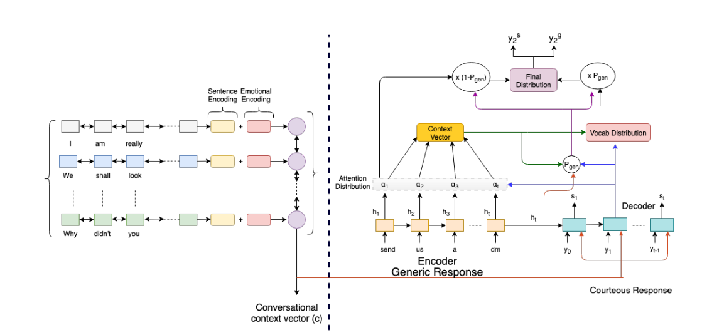

## About
This repository implements a model to do style transfer for a chatbot which is reponding to a conversation.

---

## Model



* Inputs to the model: Conversation History (left), Generic Response (centre)

* Output: Courteous Response (right). 

* The Conversation History is encoded by hierarchical BiLSTM to a Conversational Context vector c. 
    * First Level Bi-LSTM encodes utterances
    * Utterance representations are concatenated to their respective DeepMoji representations
    * Second Level Bi-LSTM encodes the sequence of utterances

* The encoder encodes the Generic Response into hidden states h<sub>i</sub> .

* Response tokens are decoded one at a time. Attention α<sub>i</sub> , and vocabulary distributions (p<sub>vocab</sub> ) are computed, and combined using p<sub>gen</sub> to produce output distribution.


---
This code has been built over the code of the ACL 2017 paper *[Get To The Point: Summarization with Pointer-Generator Networks](https://arxiv.org/abs/1704.04368)*. This code is currently being maintained.

---

```run_summarization.py``` is the top-level file to train, evaluate or test models
